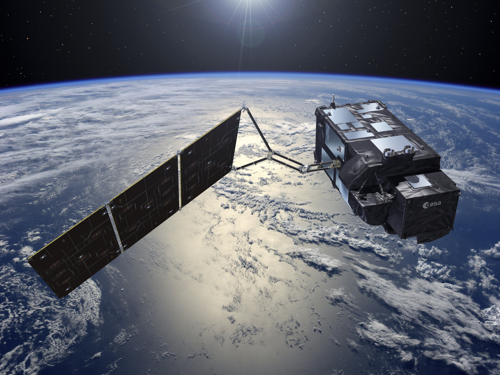
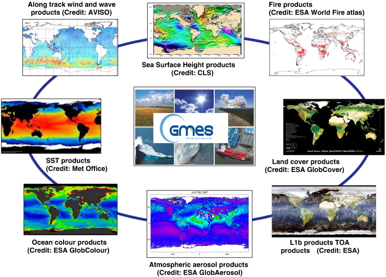

```{r setup, include=FALSE}
options(htmltools.dir.version = FALSE)
```

```{r xaringan-all, echo=FALSE}
#library(countdown)
library(xaringan)
#library(xaringanExtra)
library(knitr)

hook_source <- knitr::knit_hooks$get('source')
knitr::knit_hooks$set(source = function(x, options) {
  x <- stringr::str_replace(x, "^[[:blank:]]?([^*].+?)[[:blank:]]*#<<[[:blank:]]*$", "*\\1")
  hook_source(x, options)
})

xaringanExtra::use_tachyons()
xaringanExtra::use_broadcast()
xaringanExtra::use_freezeframe()
xaringanExtra::use_scribble()
xaringanExtra::use_slide_tone()
xaringanExtra::use_search(show_icon = TRUE, auto_search = FALSE)
xaringanExtra::use_freezeframe()
xaringanExtra::use_clipboard()
xaringanExtra::use_tile_view()
xaringanExtra::use_panelset()
xaringanExtra::use_editable(expires = 1)
xaringanExtra::use_fit_screen()
xaringanExtra::use_extra_styles(
  hover_code_line = TRUE,         
  mute_unhighlighted_code = TRUE  
)

```

```{r xaringan-themer, include=FALSE, warning=FALSE}
library(xaringanthemer)
style_mono_accent(
  base_color = "#23395b",
  header_font_google = google_font("Josefin Sans"),
  text_font_google   = google_font("Montserrat", "300", "300i"),
  code_font_google   = google_font("Fira Mono")
)
```

```{r load_packages, message=FALSE, warning=FALSE, include=FALSE}
library(fontawesome)
```

```{r, echo=FALSE}
xaringanExtra::use_progress_bar(color = "#0051BA", location = "bottom")
```

## Overview

.pull-left[
- **Copernicus Programme's linchpin for environmental monitoring.**
  - Delivering vital data on oceans, land, ice, and atmosphere (ESA, 2016).
- **Twin satellites, Sentinel-3A & 3B, ensure unmatched Earth coverage.**
  - Orbiting for global insights since 2016 and 2018.
- **Equipped with OLCI, SLSTR, and SRAL for diverse observations.**
  - Essential for tracking climate dynamics and ecosystem health.
]

.pull-right[
```{r echo=FALSE, fig.align='center'}

```

Sentinel-3  (Source: [ESA](https://www.esa.int/Space_in_Member_States/Spain/Sentinel-3_Vision_panoramica_para_Copernico))
]
---
## Introduction to Sentinel-3 Mission

- **Background Needs**
  - Europe urgently requires independent EO capability for safety and climate response, addressed by the GMES initiative of EC and ESA.

--

```{r echo=FALSE, out.width='40%', fig.align='center'}

```
<div align="center">
Sentinel-3 data products for GMES Services (Source: Donlon et al., 2012)
</div>

- **Sentinel-3 Mission Overview**
  - Developed under GMES for continuity with ENVISAT, Sentinel-3 offers EO satellite systems, mission management, and real-time data. It aims to deliver reliable, validated GMES data products, including necessary uncertainty estimates (Donlon et al., 2012).
---

## Key Sensors and Their Functions

```{R echo=FALSE}

# Create a data frame with Sentinel-3 instruments information
sentinel_instruments <- data.frame(
  Instrument = c("OLCI", "SLSTR", "SRAL"),
  Functionality = c("High-res color imagery in 21 bands (400-1020 nm).", 
                    "Surface temperature in 9 bands (550-12000 nm).", 
                    "Precise altitude with Ku and C band signals."),
  Applications = c("Ocean health, vegetation analysis, water pollution monitoring.",
                   "Global warming tracking, extreme weather, and disaster impact assessment.",
                   "Sea-level rise, ice thickness, glacier dynamics.")
)

# Use knitr::kable to create an HTML table
knitr::kable(sentinel_instruments, format = 'html')

```

--

- **Support Systems**:

  - **MWR**: Wet-tropospheric correction.
  - **Precise Orbit Determination**: GPS, DORIS, laser retro-reflector.
  - **Ground Segment**: Mission management and real-time data delivery.
  
---

## Application Cases
- **Oceanography**:
  - "Sentinel-3 satellites offer unprecedented insights into ocean dynamics, including surface temperature, marine life distribution, and pollutants. These data support the implementation of marine conservation policies and the management of marine resources."
- **Climate Change**:
  - "The mission provides crucial evidence of global warming, tracking glacier retreat, ice melt in polar regions, and changes in global sea levels. Sentinel-3's data feeds into climate models, helping predict future climate scenarios and informing global climate policy."
  
---

## Application Cases

- **Environmental Monitoring**:
  - "Sentinel-3 plays a key role in monitoring land changes, offering data on deforestation, desertification, and urban sprawl. This information is vital for sustainable land management, conservation efforts, and assessing human impact on natural habitats."
- **Disaster Management**:
  - "In the event of natural or man-made disasters, Sentinel-3's rapid data acquisition enables effective emergency response and damage assessment. This facilitates more efficient allocation of resources and helps mitigate the impact on affected communities."
  
  
---
class: inverse, center, middle

# Contributions and Future of Sentinel-3🛰
  
---
## Reflection
- **Adapting to Change**:
  - "Sentinel-3's journey reflects humanity's growing awareness and response to environmental challenges. Its data not only highlights the changes our planet is undergoing but also empowers us to take meaningful action towards sustainability."
- **Scientific and Societal Impact**:
  - "The mission's contributions extend beyond scientific research, influencing policy decisions, enhancing public awareness, and driving educational initiatives. It showcases the integral role of space technology in addressing Earth's pressing environmental issues."
  
---
## Reflection

- **A Call to Action**:
  - "While Sentinel-3 provides the data necessary for understanding environmental changes, it is up to us—researchers, policymakers, and the public—to utilize this information. It serves as a call to action for climate change mitigation, environmental conservation, and sustainable development."
  
---

## Conclusion and Resources
- **Summary**:
  - "Sentinel-3 exemplifies the critical role of Earth observation in fostering a sustainable future. Through comprehensive monitoring of our oceans, land, and atmosphere, it provides the data needed to address global environmental challenges."
- **Resources**:
  - 

---
class: inverse, center, middle

# Thank you!😊


