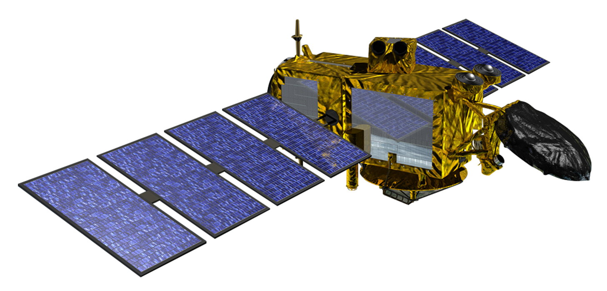

```{r setup, include=FALSE}
options(htmltools.dir.version = FALSE)
library(dplyr)
library(readr)
library(readxl)
library(knitr)
library(fontawesome)
```

```{r xaringan-all, echo=FALSE, warning=FALSE}
library(countdown)
library(xaringan)
library(xaringanExtra)
hook_source <- knitr::knit_hooks$get('source')
knitr::knit_hooks$set(source = function(x, options) {
  x <- stringr::str_replace(x, "^[[:blank:]]?([^*].+?)[[:blank:]]*#<<[[:blank:]]*$", "*\\1")
  hook_source(x, options)
})
xaringanExtra::use_broadcast()
xaringanExtra::use_freezeframe()
xaringanExtra::use_scribble()
xaringanExtra::use_search(show_icon = TRUE, auto_search	=FALSE)
xaringanExtra::use_freezeframe()
xaringanExtra::use_clipboard()
xaringanExtra::use_tile_view()
xaringanExtra::use_panelset()
xaringanExtra::use_editable(expires = 1)
xaringanExtra::use_fit_screen()
xaringanExtra::use_extra_styles(
  hover_code_line = TRUE,         
  mute_unhighlighted_code = TRUE  
)
```


```{r xaringan-themer, include=FALSE, warning=FALSE}
library(xaringanthemer)
style_mono_accent(
  base_color = "#23395b",
  header_font_google = google_font("Josefin Sans"),
  text_font_google   = google_font("Montserrat", "300", "300i"),
  code_font_google   = google_font("Fira Mono")
)
```

```{r, echo=FALSE}
xaringanExtra::use_progress_bar(color = "#0051BA", location = "bottom")
```

```{r, echo=FALSE, message=FALSE, warning=FALSE, include=FALSE}
library(RefManageR)
BibOptions(check.entries = FALSE,
           bib.style = "authoryear",
           cite.style = "authoryear",
           style = "markdown",
           hyperlink = TRUE,
           dashed = FALSE,
           no.print.fields=c("doi", "url", "urldate", "issn"))
myBib <- ReadBib("./Bib.bib", check = FALSE)

```

class: center, title-slide, middle

background-image: url("img/cover.jpg")
background-size: cover
background-position: center

# Sentinel-3
## Monitoring Earth for a Sustainable Future
### Muhan Yang/<br>CASA, UCL

### 18/01/2024 (updated: 2023-02-18)

---

## Overview

.pull-left[
- **Copernicus Programme's linchpin for environmental monitoring.**
  - Delivering vital data on oceans, land, ice, and atmosphere (ESA, 2016).
- **Twin satellites, Sentinel-3A & 3B, ensure unmatched Earth coverage.**
  - Orbiting for global insights since 2016 and 2018.
- **Equipped with OLCI, SLSTR, and SRAL for diverse observations.**
  - Essential for tracking climate dynamics and ecosystem health.
]

.pull-right[
```{r echo=FALSE, fig.align='center'}
knitr::include_graphics('img/Sentinel-3_pillars.jpg')
```

Sentinel-3  (Source: [ESA](https://www.esa.int/Space_in_Member_States/Spain/Sentinel-3_Vision_panoramica_para_Copernico))
]
---
## Introduction to Sentinel-3 Mission

- **Background Needs**
  - Europe urgently requires independent EO capability for safety and climate response, addressed by the GMES initiative of EC and ESA.

```{r echo=FALSE, out.width='40%', fig.align='center'}
knitr::include_graphics('img/1-s2.0-S0034425712000685-gr1.jpg')
```
<div align="center">
Sentinel-3 data products for GMES Services (Source: Donlon et al., 2012)
</div>

- **Sentinel-3 Mission Overview**
  - Developed under GMES for continuity with ENVISAT, Sentinel-3 offers EO satellite systems, mission management, and real-time data. It aims to deliver reliable, validated GMES data products, including necessary uncertainty estimates (Donlon et al., 2012).
---

## Key Sensors and Their Functions

```{R echo=FALSE}

# Create a data frame with Sentinel-3 instruments information
sentinel_instruments <- data.frame(
  Instrument = c("OLCI", "SLSTR", "SRAL"),
  Functionality = c("High-res color imagery in 21 bands (400-1020 nm).", 
                    "Surface temperature in 9 bands (550-12000 nm).", 
                    "Precise altitude with Ku and C band signals."),
  Applications = c("Ocean health, vegetation analysis, water pollution monitoring.",
                   "Global warming tracking, extreme weather, and disaster impact assessment.",
                   "Sea-level rise, ice thickness, glacier dynamics.")
)

# Use knitr::kable to create an HTML table
knitr::kable(sentinel_instruments, format = 'html')

```

--

- **Support Systems**:

  - **MWR**: Wet-tropospheric correction.
  - **Precise Orbit Determination**: GPS, DORIS, laser retro-reflector.
  - **Ground Segment**: Mission management and real-time data delivery.
  
---

class: inverse, center, middle

## Contributions and Future of Sentinel-3🛰

.center[
<iframe width="560" height="315" src="https://www.youtube.com/embed/T9WCWnk_qN4?si=_a_2vpVSxVUR-8Cn" title="YouTube video player" frameborder="0" allow="accelerometer; autoplay; clipboard-write; encrypted-media; gyroscope; picture-in-picture; web-share" allowfullscreen></iframe>
]
  
---

## Application Cases: Maritime Monitoring
Sentinel-3 satellites are key to ocean conservation, providing essential data on sea temperatures, marine ecosystems, and pollutants. This information is critical for:

--

  - **Ocean Dynamics**: They track sea surface temperatures and heights to study currents and climate effects, essential for weather forecasting (Mulero-Martinez et al. 2022) and climate analysis.
  
--

  - **Marine Life**: Analyzing ocean color, they identify phytoplankton and assess ecosystem health `r Citep(myBib,"Ogashawara2019")`, aiding fisheries management and biodiversity protection.
  
--

  - **Pollution**: Equipped to spot oil spills and pollutants, they bolster disaster response and pollution control, protecting marine and coastal environments.
  
---
## Application Cases: Land monitoring
Sentinel-3 significantly impacts land management, aiding in agriculture, forestry, and urban planning through its comprehensive land observations. It offers crucial insights into:

--

  - **Vegetation Health and Land Cover**: Essential for evaluating vegetation condition, agricultural practices, and land cover changes, supporting food security and resource management.
  
--

  - **Surface Temperature and Fire Detection**: Measures land temperature, vital for water management and early wildfire detection, enhancing disaster response and risk reduction.
  
--

  - **Water Bodies Monitoring**: Provides detailed views of aquatic systems, aiding in water quality and hydrology studies (Moro et al. 2022), crucial for resource management and ecosystem support.

---

## Reflection: Jason-3 VS Sentinel-3a
Jason-3 and Sentinel-3a lead in ocean monitoring, crucial for global sea level analysis, differing in design and scope.

.pull-left[
- **Jason-3**: Focuses on precise sea surface height measurements, advancing the TOPEX/Poseidon legacy with detailed sea level data.

- **Sentinel-3a**: ESA's Copernicus asset, Sentinel-3a broadens the scope with sea surface height, temperature, ocean color, and more, enhancing environmental monitoring.
]

.pull-right[
```{r echo=FALSE, fig.align='center'}

```
    
    
    
Jason-3 (Source: [NASA](https://www.jpl.nasa.gov/missions/jason-3))
]

--

**Distinction**: The main distinction between the two lies in Sentinel-3a's orbit and measurement approaches, enabling it to **cover more of the Earth and collect a variety of environmental data**. This capability enriches its monitoring tasks but may influence its **precision in tracking long-term sea level changes** compared to Jason-3 `r Citep(myBib,"Zawadzki2016")`.
  
---
## Reflection: Future Development Considerations


Facing the challenges of climate change, the demand for global sea level monitoring is increasing, necessitating future satellite missions to balance between **measurement precision and monitoring scope**.

It is expected that through technological innovation and international collaboration, future satellite missions will provide **higher precision sea level data** while covering a wider range of environmental indicators to support global climate change research.

Furthermore, ensuring **data continuity and accuracy** through seamless relay between satellite missions and calibration will be crucial. This may require developing new algorithms and calibration techniques to integrate data from different satellite missions.

  
---

## References
Donlon, C. et al. (2012). The Global Monitoring for Environment and Security (GMES) Sentinel-3 mission, Remote Sensing of Environment, årg. 120, s. 37–57.

Moro, L.D. et al. (2022). Geospatial Analysis with Landsat Series and Sentinel-3B OLCI Satellites to Assess Changes in Land Use and Water Quality over Time in Brazil, Sustainability, årg. 14, nr. 15, s. 9733.

Mulero-Martinez, R. et al. (2022). The Use of Sentinel-3 Altimetry Data to Assess Wind Speed from the Weather Research and Forecasting (WRF) Model: Application over the Gulf of Cadiz, Remote Sensing, årg. 14, nr. 16, s. 4036.

```{R, results='asis', echo=FALSE, message=FALSE, warning=FALSE}
PrintBibliography(myBib, start = 1, end = 5)
```

---
class: inverse, center, middle

# Thank you!😊


